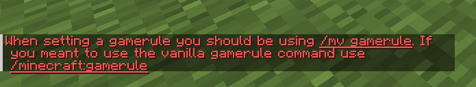

# GameruleBlocker
1.21 spigot plugin to prevent staff from accidentally running the vanilla `/gamerule` instead of `/mv gamerule` (or an equivalent). This plugin is intended to be run alongside multiverse to prevent messing with other worlds gamerule settings, but can be used for whatever other purpose you need it for.

<details>
<summary>Screenshots</summary>

>  <break>
> The default chat message when running /gamerule.
</details>


---
### config.yml

> [!TIP]
> You can use hex codes with the following format: `&#FFC0CB`
```yml
# this is the message that displays to staff when they run /gamerule.
messages: "&cWhen setting a gamerule you should be using &n/mv gamerule&r&c. If you meant to use the vanilla gamerule command use &n/minecraft:gamerule&r&c"
```